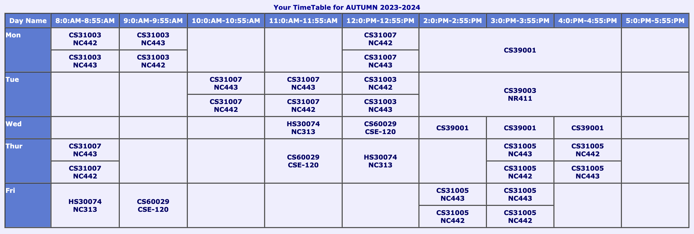

# 5TH-SEMESTER-CSE

[Website](https://garggopal2001.github.io/cse_material/#sem05)

## Previous Batch Lectures

[Algorithms-II](https://www.youtube.com/playlist?list=PLO11h2zbAVtMCvIrMguydfHjJnGkRkcum)

[Compilers](https://www.youtube.com/playlist?list=PLO11h2zbAVtP5nseM6Sqc0g0M6DvD9LEk)

[Compilers Laboratory](https://www.youtube.com/playlist?list=PLO11h2zbAVtPH00XyivKmOWvDziVM51xy)

[Computer Organization and Architecture](https://www.youtube.com/playlist?list=PLO11h2zbAVtNaWFleQo2vv86Sr45NS2dD)

[Computer Organization Laboratory](https://www.youtube.com/playlist?list=PLO11h2zbAVtNNy0LWKIzZcUnjk_hW8lvJ)
